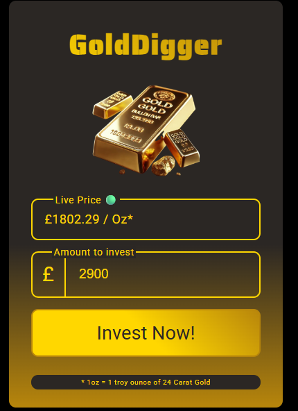
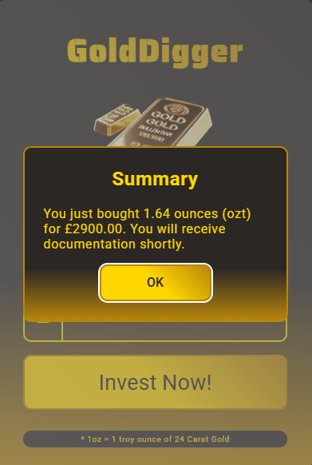

# GoldDigger 

A simple and elegant platform for gold exchange and investment tracking. Get live gold prices and make informed investment decisions with ease.

## Features

- **Live Gold Prices**: Real-time gold price updates (per troy ounce)
- **Investment Calculator**: Calculate how much gold you can buy with your investment amount
- **Clean Interface**: Simple, user-friendly interface for gold trading
- **Investment Tracking**: Record and track your gold investments

## Tech Stack

- **Backend**: Node.js (vanilla HTTP server)
- **Frontend**: HTML5, CSS3, Vanilla JavaScript
- **Architecture**: Modular routing system with utility functions

## Project Structure

```
Gold Digger/
├── public/              # Static files (HTML, CSS, JS, images)
│   ├── index.html      # Main page
│   ├── index.css       # Styling
│   ├── index.js        # Client-side JavaScript
│   ├── 404.html        # Error page
│   └── record.json     # Investment records
├── routes/
│   └── routes.js       # API route handlers
├── utils/
│   ├── fileHandler.js  # File system utilities
│   └── randomPrice.js  # Price generation utilities
├── server.js           # Main server file
└── package.json        # Project dependencies
```

## Getting Started

### Prerequisites

- Node.js (v14 or higher)

### Installation

1. Clone the repository:
   ```bash
   git clone <repository-url>
   cd "Gold Digger"
   ```

2. Install dependencies (if any are added):
   ```bash
   npm install
   ```

### Running the Application

**Development mode** (with auto-reload):
```bash
npm run dev
```

**Production mode**:
```bash
npm start
```

The server will start on `http://localhost:3000` (or the port specified in the `PORT` environment variable).

## API Endpoints

- `GET /` - Main application page
- `GET /price` - Get current gold price
- `POST /investment` - Submit investment details
- `GET /404.html` - Error page for invalid routes

## Usage

1. Open the application in your browser at `http://localhost:3000`
2. View the live gold price per troy ounce
3. Enter your investment amount in pounds (£)
4. Click "Invest Now!" to see how much gold you can purchase
5. Review your investment summary

## Author

**Adnan Ahmad**

## Preview


## License

ISC License

---

*1oz = 1 troy ounce of 24 Carat Gold*
